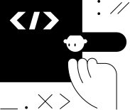

<!-- PROJECT SHIELDS
*** I'm using markdown "reference style" links for readability.
*** Reference links are enclosed in brackets [ ] instead of parentheses ( ).
*** See the bottom of this document for the declaration of the reference variables
*** This is an optional, concise syntax you may use.
*** https://www.markdownguide.org/basic-syntax/#reference-style-links
-->

<!-- HEADER -->

[![Python][python-shield]][python-url]
[![License][license-shield]][license-url]
[![LinkedIn][linkedin-shield]][linkedin-url]

# Python exercises - JetBrains Academy



_solutions to programming problems from [JetBrains Academy][jbacademy-url]_

## Features

- The solutions are organised in to own folders: [Simple Banking System](./Simple%20Banking%20System) and [Text-Based Browser](./Text-Based%20Browser)
- Switch to one of the folders and find `task` folder - from there you can run the actual task
- Each folder contains the original task description

## Installation

1. Clone this repository:

```
$ git clone https://github.com/andrejkurusiov/python-jetbrains-academy.git [your-folder-name]
```

2. _(optional)_\* Install [Python](https://www.python.org/downloads/)
3. Install packages with `pip`:

```
$ pip install -r requirements.txt
```

4. Run: `$ python filename.py`

(\*) _instead of installing Python locally, you can use online service, such as [Google Colab][google-colab-url]._

## License

Distributed under the [MIT License](./LICENSE).

<!-- MARKDOWN LINKS & IMAGES -->
[license-shield]: https://img.shields.io/github/license/andrejkurusiov/python-jetbrains-academy
[license-url]: ./LICENSE
[linkedin-shield]: https://img.shields.io/badge/LinkedIn-Profile-informational?style=flat&logo=linkedin
[linkedin-url]: https://www.linkedin.com/in/andrejkurusiov/
[python-shield]: https://img.shields.io/badge/Python-545454.svg?style=flat&logo=python
[python-url]: https://python.org/
[google-colab-url]: https://colab.research.google.com/
[jbacademy-url]: https://www.jetbrains.com/academy/
